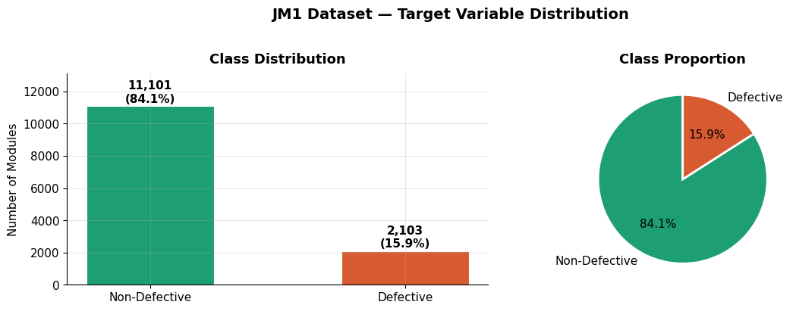
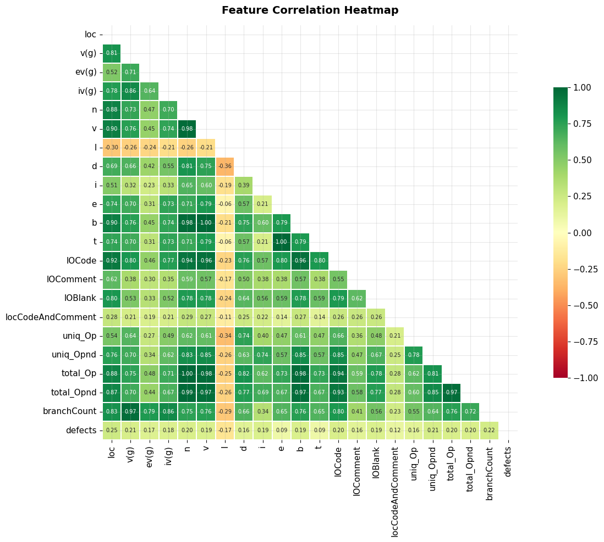
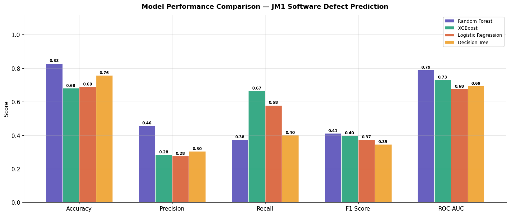
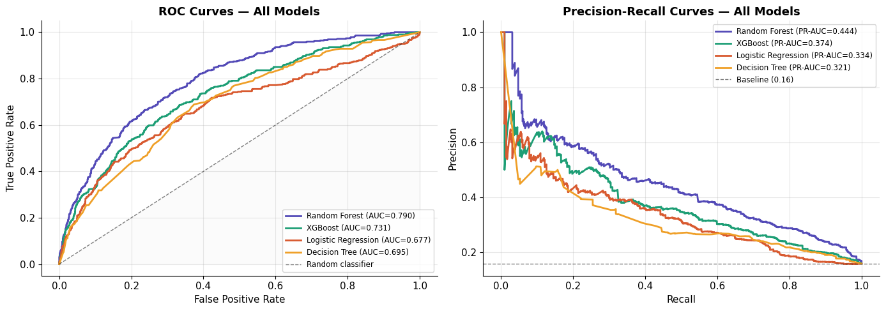
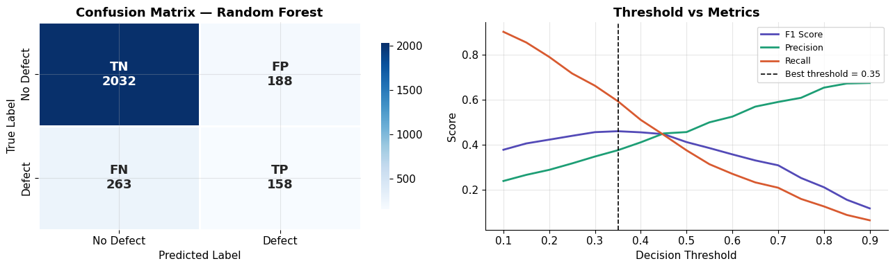
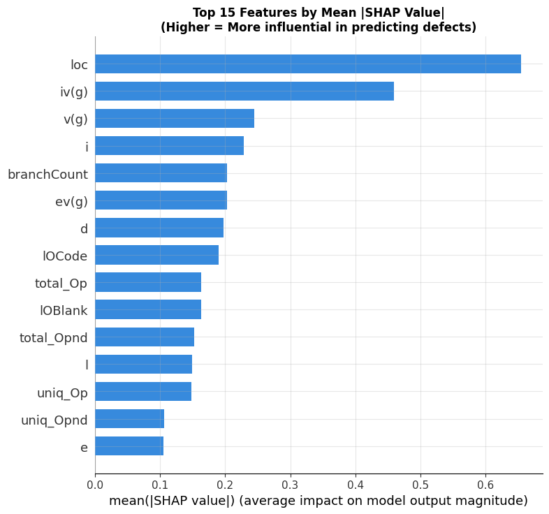
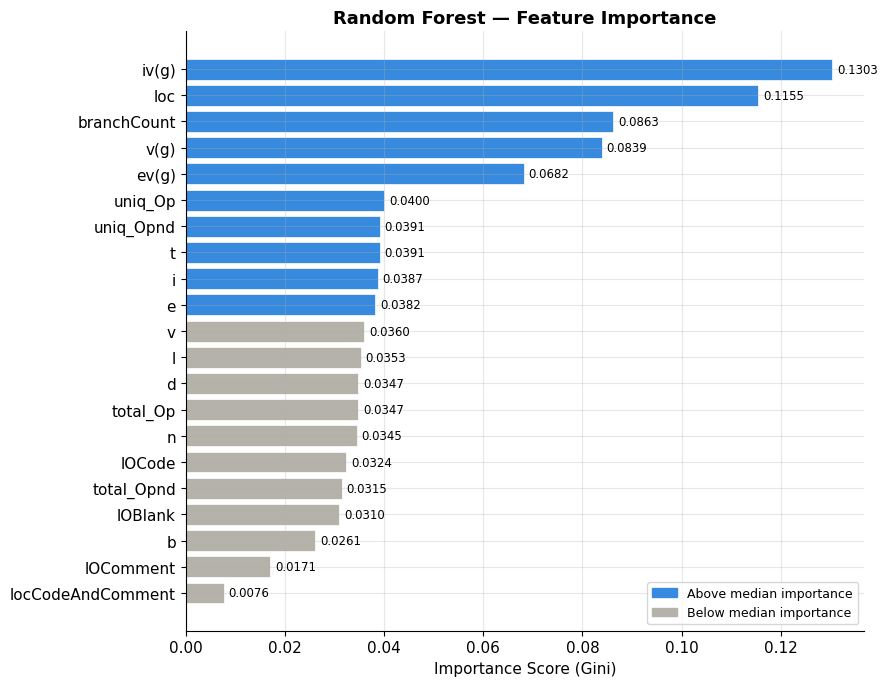

# JM1 Software Defect Prediction using Machine Learning

Predicting defect-prone software modules from static code metrics using classical ML and gradient boosting, with class-imbalance handling, hyperparameter tuning, and SHAP-based explainability.

**Dataset:** NASA JM1 · **Language:** Python · **Platform:** Google Colab
**Models compared:** Logistic Regression · Decision Tree · Random Forest · XGBoost
**Key techniques:** SMOTE (class imbalance) · GridSearchCV (tuning) · SHAP (explainability)

---

## Overview

This project trains and compares four classifiers to predict whether a software module is defective, using the NASA **JM1** dataset — 21 McCabe/Halstead static code metrics per module (lines of code, cyclomatic complexity, Halstead volume/effort, branch count, etc.). The pipeline includes exploratory data analysis, SMOTE-based class balancing, model comparison, hyperparameter tuning, and SHAP explainability, plus a live "predict on custom input" demo for showing the model in action.

## Repository Structure

```
jm1-software-defect-prediction/
├── data/
│   ├── jm1.csv                     # NASA JM1 dataset (13,204 modules, 21 metrics + defect label)
│   ├── bug_dataset_large.csv       # Supplementary defect dataset used for extended experiments
│   └── data_README.md              # Column definitions and data source notes
├── notebooks/
│   ├── 01_baseline_random_forest.ipynb        # Initial baseline pipeline
│   ├── 02_improved_pipeline_no_leakage.ipynb  # Split-before-resample fix + GridSearchCV
│   └── JM1_Defect_Prediction_Final.ipynb      # Full pipeline: EDA, 4-model comparison, tuning, SHAP, live predictor
├── figures/
│   ├── fig_class_distribution.png          # Class imbalance (84% / 16%)
│   ├── fig_correlation_heatmap.png         # Feature correlation heatmap
│   ├── fig_top_feature_correlations.png    # Top features correlated with defects
│   ├── fig_model_comparison_bar.png        # Accuracy/Precision/Recall/F1/ROC-AUC across all 4 models
│   ├── fig_roc_curves.png                  # ROC curves, all models
│   ├── fig_confusion_matrix_threshold.png  # Confusion matrix + precision/recall vs. threshold
│   ├── fig_rf_feature_importance.png       # Random Forest built-in feature importance
│   ├── fig_shap_summary_1.png              # SHAP summary plot
│   ├── fig_shap_summary_2.png              # SHAP summary plot (alternate view)
│   ├── fig_shap_force_plot.png             # SHAP force plot for a single prediction
│   ├── fig_cv_comparison.png               # Cross-validation score comparison
│   ├── fig_learning_curve.png              # Learning curve
│   ├── fig1_system_architecture.svg
│   ├── fig2_smote_flowchart.svg
│   ├── fig3_random_forest_diagram.svg
│   └── fig4_xgboost_diagram.svg
├── train_model.py                  # Standalone production-style training script
├── requirements.txt
├── LICENSE
└── README.md
```

## Dataset

**JM1** (NASA Metrics Data Program) — 13,204 software modules written in C, each described by 21 static code metrics and a binary `defects` label. Class distribution is imbalanced: ~16% of modules are defective, ~84% are not.

| Split | Samples | Defect rate |
|---|---|---|
| Train | 10,563 | 15.9% |
| Test | 2,641 | 15.9% |

Stratified splitting keeps the same class ratio in both sets. See `data/data_README.md` for the full column reference.



## Methodology

1. **Install & import** — `scikit-learn`, `imbalanced-learn`, `xgboost`, `shap`.
2. **Load & data quality check** — missing values, dtypes.
3. **EDA** — class distribution, correlation heatmap, top feature correlations with the target.

   

4. **Train/test split (stratified, 80/20)** — done *before* any resampling, to prevent test-set leakage.
5. **Train all 4 models with SMOTE** — each model is wrapped in a pipeline where SMOTE is fit only on the training fold within cross-validation, avoiding leakage.
6. **Compare models** — accuracy, precision, recall, F1, and ROC-AUC across all four.

   
   

7. **Confusion matrix & threshold analysis** for the best model, with F1/precision/recall plotted across decision thresholds (default 0.5 isn't always optimal for imbalanced problems).

   

8. **Hyperparameter tuning** — `GridSearchCV` (5-fold stratified CV, F1 scoring) on XGBoost.
9. **Explainability with SHAP** — feature-level contribution to each prediction, plus Random Forest's built-in feature importance for comparison.

   
   

10. **Cross-validation comparison & learning curve** — checks that performance is stable across folds and that more data would (or wouldn't) help.
11. **Live custom-input predictor** — enter a module's metrics (lines of code, cyclomatic complexity, etc.) and get a live defect-probability prediction with a risk gauge — useful for demoing the model interactively during a review.

## Results

Evaluated on the JM1 held-out test set (n = 2,641):

| Model | Accuracy | Precision | Recall | F1 Score | ROC-AUC |
|---|---|---|---|---|---|
| **Random Forest** ⭐ | 0.829 | 0.457 | 0.375 | **0.412** | **0.790** |
| XGBoost | 0.680 | 0.285 | 0.665 | 0.399 | 0.731 |
| Logistic Regression | 0.691 | 0.276 | 0.580 | 0.374 | 0.677 |
| Decision Tree | 0.758 | 0.304 | 0.401 | 0.346 | 0.695 |

**Random Forest is the best-performing model** on this dataset by both F1 and ROC-AUC.

**Tuned XGBoost** (after GridSearchCV, optimizing for F1 via 5-fold CV): best CV F1 = 0.406, test set — Accuracy 0.684, Precision 0.284, Recall 0.649, F1 0.395, ROC-AUC 0.728. Tuning improved XGBoost's recall substantially (catching more true defects) at the cost of precision (more false alarms) — a tradeoff worth tuning to the actual cost of a missed defect vs. a false alarm in a real deployment.

**Key findings:**
- Random Forest achieves the best overall F1 and ROC-AUC on this dataset.
- SMOTE effectively addresses the 84:16 class imbalance during training.
- `loc` (lines of code), `branchCount`, and `v(g)` (cyclomatic complexity) are the strongest individual defect predictors.
- The precision-recall tradeoff can be tuned via the decision threshold rather than accepting the default 0.5 cutoff.
- SHAP confirms that code complexity metrics are the dominant drivers of predicted defect probability, consistent with the built-in Random Forest feature importances.

## Setup

```bash
pip install -r requirements.txt
```

Run the full pipeline notebook:
```bash
jupyter notebook notebooks/JM1_Defect_Prediction_Final.ipynb
```

Or run the standalone training script:
```bash
python train_model.py --data data/jm1.csv --output model.pkl
```

## Key Takeaways

- Splitting the data *before* resampling/scaling — rather than after — is essential to getting a trustworthy estimate of real-world performance; this project explicitly follows that order.
- Ensemble tree models (Random Forest, XGBoost) outperform linear models on this dataset, consistent with published NASA MDP benchmark results.
- Recall on the defective class remains the harder problem — a reminder that static-metric-only defect prediction has real limits, and precision/recall tradeoffs should be tuned to the cost of missed defects vs. false alarms in a given deployment context.
- SHAP explainability makes individual predictions auditable — useful for justifying *why* a specific module was flagged, not just that it was.

## License

MIT — see `LICENSE`.
